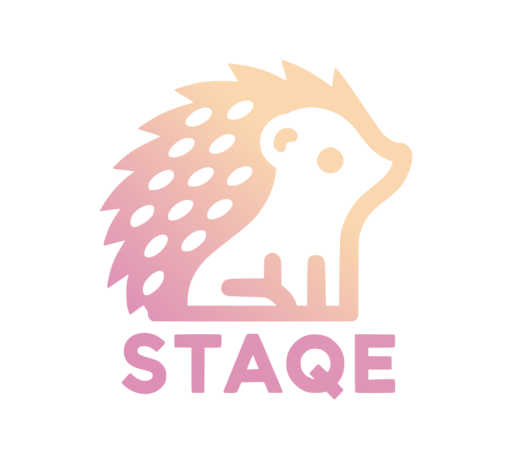
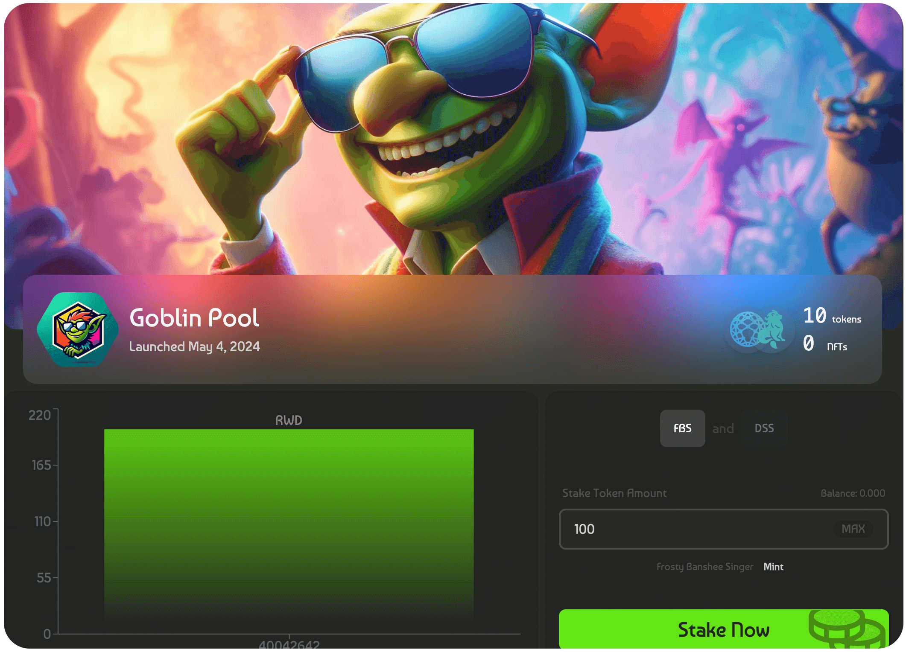
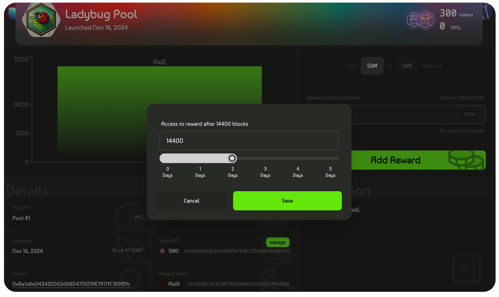
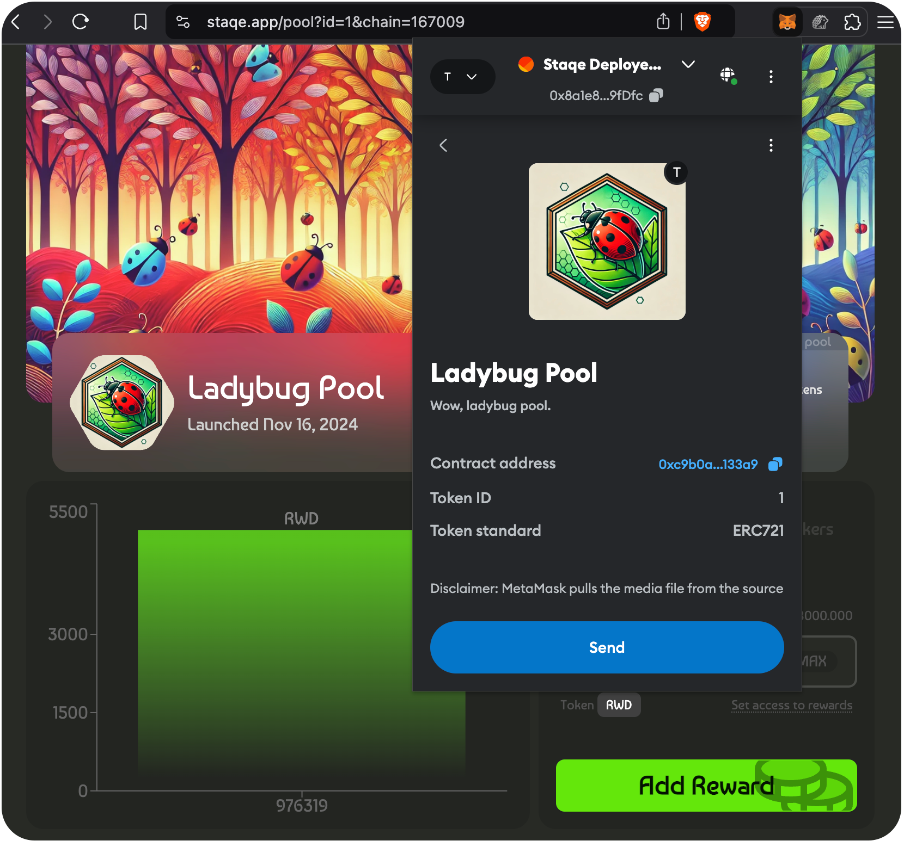
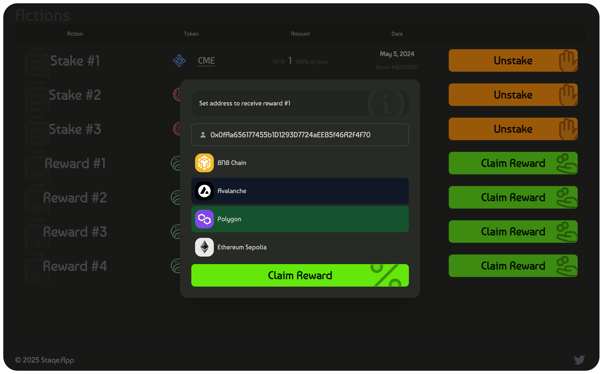
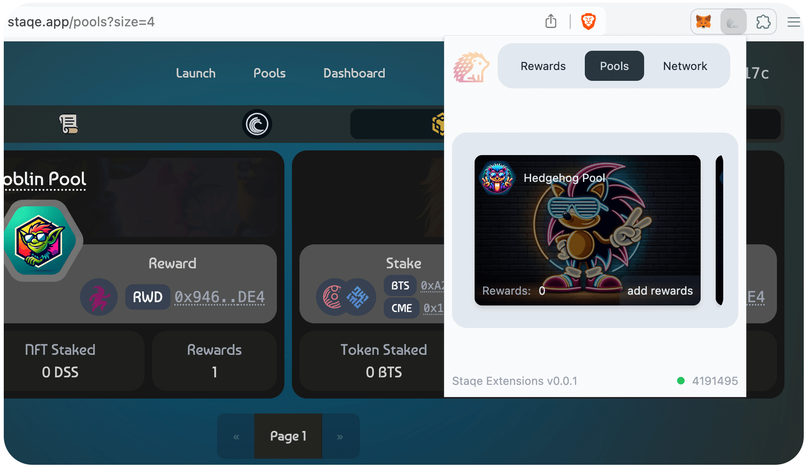
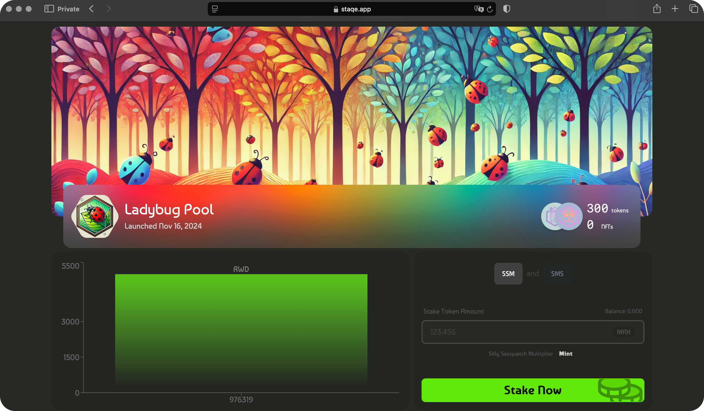

<!-- npx @marp-team/marp-cli@latest marp.md -o index.html -->



# **Staqe Protocol**

## Launch your project or increase the liquidity of an existing token.

---



## **What is Staqe Protocol?**

- Decentralized, non-custodial staking platform.
- Stake **ERC20 tokens** and **NFTs (ERC721)**.
- Cross-chain rewards and interoperability powered by **Chainlink CCIP**.
- Transparent and customizable liquidity pools.

---



## **Key Features**

1. **NFT & ERC20 Token Staking**: Stake both types of assets.
2. **Dynamic Pool Creation**: Configure tokens, rewards, and metadata.
3. **Reward Distribution**: On-chain and cross-chain claims.
4. **ERC721 Pool Ownership**: Tradeable pools as NFTs.
5. **Cross-Chain Interoperability**: Reward claims across multiple networks.

---



## **ERC721 Pool Ownership**

- Each staking pool is an **ERC721-compliant NFT**.
- Transfer or trade ownership via NFT marketplaces.
- Metadata securely stored using IPFS.

---



## **Cross-Chain Interoperability**

- Enabled by **Chainlink CCIP**.
- Rewards can be claimed across EVM-compatible chains.
- Chain-agnostic staking for ultimate flexibility.

---

## **How It Works**

### **Pool Creation**

Genesis NFT holders launch pools with custom configurations:

```solidity
launchPool(
  IERC20 stakeERC20,
  IERC721 stakeERC721,
  IERC20 rewardToken,
  uint256 totalMax,
  string memory tokenURI
);
```

---

## **How It Works**

### **Token Staking**

Participants stake tokens in a pool via the `stake` function:

```solidity
stake(
  uint256 poolId,
  uint256 amount,
  uint256 id
);
```

---

## **How It Works**

### **Reward Distribution**

Pool owners add rewards using the `addReward` function:

```solidity
addReward(
  uint256 poolId,
  IERC20 rewardToken,
  uint256 rewardAmount,
  uint256 claimAfterBlocks,
  bool isForERC721Stakers
);
```

---

## **How It Works**

### **Claiming Rewards**

Stakers can claim rewards directly or cross-chain:

```solidity
claimRewards(
  uint256[] memory poolIds,
  uint256[][] memory rewardIds,
  address recipient
);
```

---

## **Dynamic Visualizations**



- **Bubble Dashboard**: Visualize staked assets dynamically.
- **Browser Extension**: Track staking activities and rewards.

---

## **Why Staqe Protocol?**



- Decentralized and secure.
- NFT-driven ownership of staking pools.
- Seamless cross-chain interoperability.
- Transparent and user-centric ecosystem.
- App: [staqe.app](staqe.app)
